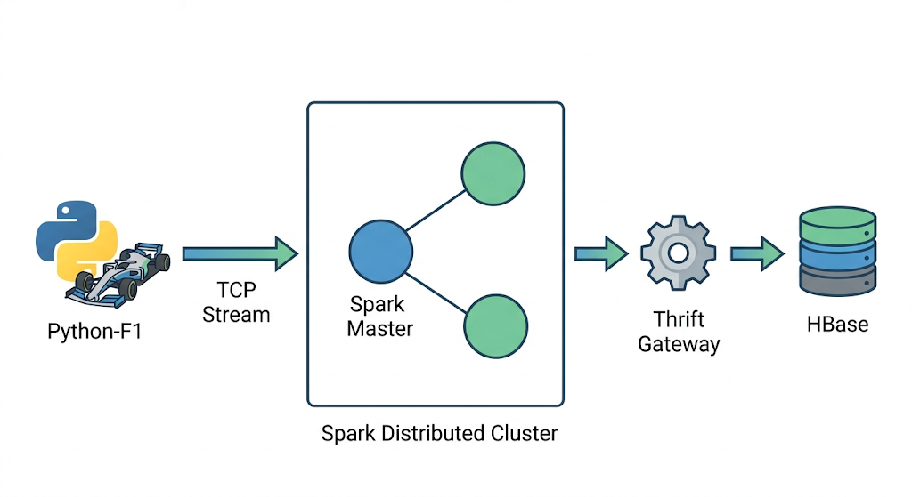
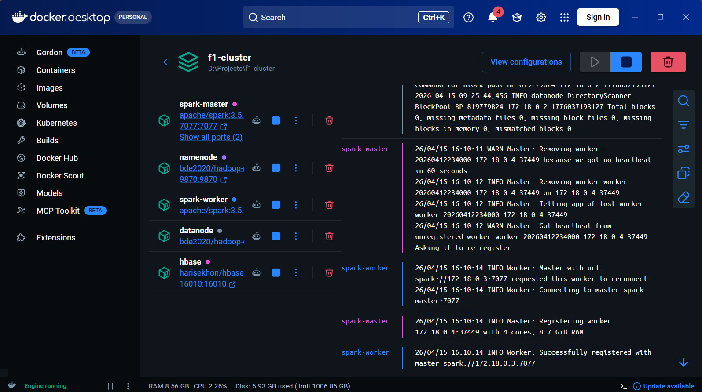
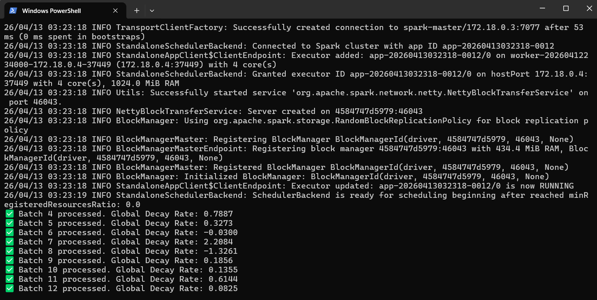
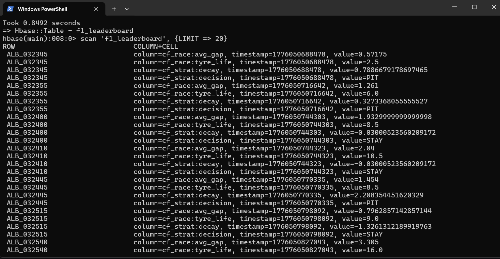

# F1 Real-Time Strategy Engine: Spark Streaming & HBase Pipeline

## Overview & Business Impact
In Formula 1, race strategy is a battle of milliseconds. Predicting the exact moment a driver will "hit the cliff" (sudden tire performance loss) is critical for executing a successful undercut. 

This project is a real-time, distributed data pipeline that ingests live F1 telemetry, filters out non-racing noise, and runs predictive machine learning models concurrently. By calculating tire performance decay on the fly, the system generates near real-time "Pit" or "Stay" tactical triggers, mirroring the telemetry systems used by real-world F1 pit walls.

**Author:** Anij Mehta

## Technical Challenges Overcome
* **Low-Latency Streaming:** Configured Apache Spark Streaming with a 5-second sliding window and 30-second duration to maintain stateful moving averages without memory bottlenecks.
* **Data Quality on the Fly:** Implemented aggressive filtering at the Bronze layer to drop non-racing laps (`IsPitStop == True`) from the FastF1 socket stream, preventing outliers from skewing the MLlib model.
* **Distributed State Management:** Managed real-time upserts of ML predictions into Apache HBase (`f1_leaderboard`) to ensure the dashboard reflects the absolute latest tactical triggers without read-locks.

## Architecture & System Design
The pipeline is containerized using Docker and follows a Medallion architecture for robust data quality:



1. **Bronze Layer (Ingestion):** `f1_streamer.py` fetches live telemetry via the FastF1 API and streams raw JSON over a TCP socket.
2. **Silver Layer (Aggregation):** PySpark calculates moving averages of `GapToAhead` and `TyreLife` over the streaming dataframes.
3. **Gold Layer (Machine Learning & Storage):** `f1_strategy_gold.py` applies Spark MLlib's Linear Regression to calculate a tire "decay rate." A decay rate breaching a 0.2-second margin triggers a `PIT` alert, immediately persisted to HBase for downstream querying.

## Tech Stack
* **Stream Processing:** Apache Spark (PySpark), Spark Streaming, Spark MLlib
* **Storage:** Apache HBase, Hadoop (HDFS)
* **Infrastructure:** Docker, Docker Compose
* **Data Ingestion:** FastF1 API, Python Sockets

---

## Quick Start Guide

### 1. Spin up the Distributed Cluster
Initialize the Hadoop, HBase, and Spark containers via Docker Compose:
```bash
docker-compose up -d
```

Expected cluster deployment state:


2. Start the Telemetry Stream
```bash
python f1_streamer.py
```

3. Submit the Spark ML Job

Connect to the Spark Master to run the strategy engine:
```bash

docker exec -it spark-master bash
cd /opt/spark/work-dir
spark-submit f1_strategy_gold.py
```

Live micro-batch processing logs:


4. Query Tactical Triggers

Monitor the live leaderboard and pit-stop triggers via the HBase shell:
```Bash

docker exec -it hbase hbase shell
scan 'f1_leaderboard', {LIMIT => 20}
```

Persisted analytical results inside HBase:

